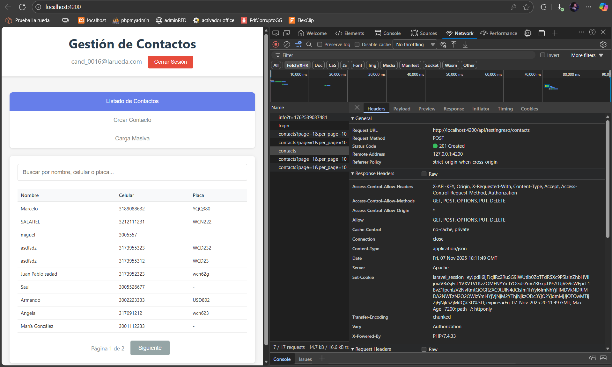
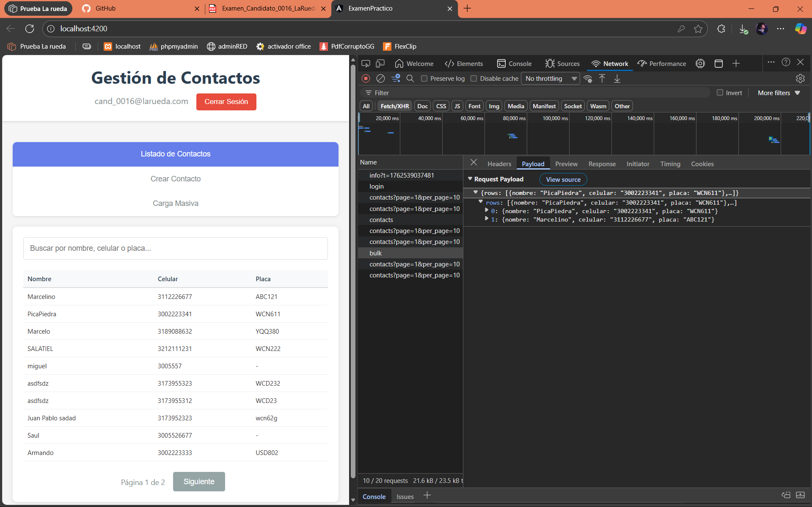
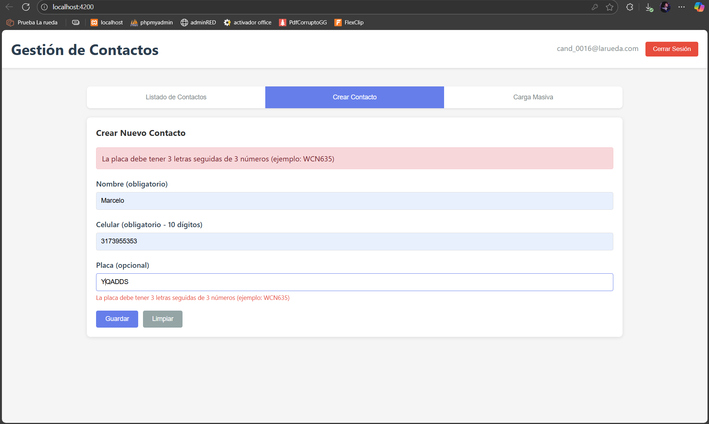

# Examen Práctico – Desarrollador Junior  La Rueda S.A.S.

Proyecto desarrollado para el examen. Incluye autenticación, listado de contactos con búsqueda, creación individual y carga masiva de contactos.

# 📋 Requisitos Previos

Antes de comenzar, asegurar de tener instalado:

- **Node.js**        (versión 12.x o 14.x)
- **npm**            (se instala automáticamente con Node.js)
- **Angular CLI 11** (se instalará en el siguiente paso)

Es importante tener en cuentas las versiones debido a que se trabajó con angular 11, las versiones 
recientes de node no funcionan del todo bien en conjunto con angular.


## 🚀 Instalación

### 1. Instalar Angular CLI 11

```bash
npm install -g @angular/cli@11
```

### 2. Clonar/Descargar el proyecto

Descarga o clonar el proyecto y accede a la carpeta

```bash
cd nombre-del-proyecto
```

### 3. Instalar dependencias

```bash
npm install
```


## ▶️ Ejecutar la Aplicación

Inicia el servidor de desarrollo:

```bash
npm start
```

O usando Angular CLI directamente:

```bash
ng serve --proxy-config proxy.conf.json
```

La aplicación estará disponible en: **http://localhost:4200**

---

## 🔑 Credenciales de Acceso

Usa estas credenciales para iniciar sesión:

- **Email:** `cand_0016@larueda.com`
- **Password:** `Password123`

---

## ✨ Funcionalidades Implementadas

### 1. **Login**
- Autenticación con email y password
- Manejo de errores de autenticación
- Almacenamiento de token y datos del usuario

### 2. **Listado de Contactos**
- Visualización en tabla
- Búsqueda en tiempo real por nombre, celular o placa
- Paginación (10 contactos por página)
- Recarga automática después de crear contactos

### 3. **Crear Contacto Individual**
- Formulario con validación
- **Nombre:** Obligatorio
- **Celular:** Obligatorio, exactamente 10 dígitos numéricos
- **Placa:** Opcional, formato 3 letras + 3 números (ejemplo: WCN635)
- Mensajes de error descriptivos
- Validación en tiempo real

### 4. **Carga Masiva de Contactos**
- Carga múltiples contactos mediante JSON
- Validación de estructura JSON
- Validación de cada contacto antes de enviar
- Mensajes de error específicos por contacto
- Conversión automática de placas a mayúsculas

---

## 📁 Estructura del Proyecto


src/
├── app/
│   ├── services/
│   │   └── api.service.ts          # Servicio para consumir la API
│   ├── app.component.ts             # Componente principal con lógica
│   ├── app.component.html           # Template de la aplicación
│   ├── app.module.ts                # Módulo principal
│   └── app-routing.module.ts        # Configuración de rutas (si aplica)
├── styles.css                       # Estilos globales
├── main.ts                          # Punto de entrada de la aplicación
└── index.html                       # HTML principal
proxy.conf.json                      # Configuración del proxy para CORS


## 🌐 API Endpoints Utilizados

**Base URL:** `https://api.larueda.com.co/api/testingreso`

| Método | Endpoint | Descripción |
|--------|----------|-------------|
| POST | `/auth/login` | Autenticación de usuario |
| GET | `/contacts` | Listar contactos (con búsqueda y paginación) |
| POST | `/contacts` | Crear un contacto individual |
| POST | `/contacts/bulk` | Carga masiva de contactos |

**Headers requeridos:**
- `Authorization: Bearer {token}`
- `X-CANDIDATE-ID: CAND_0016`
- `Content-Type: application/json`

---

## 🎨 Tecnologías Utilizadas

- **Angular 11** - Framework principal
- **TypeScript** - Lenguaje de programación
- **RxJS** - Manejo de peticiones asíncronas
- **HttpClient** - Consumo de API REST
- **CSS3** - Estilos y diseño responsive

---

## 📝 Validaciones Implementadas

### Crear Contacto Individual:
- ✅ Nombre obligatorio
- ✅ Celular obligatorio con formato exacto de 10 dígitos
- ✅ Placa opcional con formato 3 letras + 3 números (WCN635)
- ✅ Conversión automática de placa a mayúsculas
- ✅ Validación en tiempo real mientras el usuario escribe
- ✅ Mensajes de error descriptivos

### Carga Masiva:
- ✅ Validación de JSON válido
- ✅ Validación de estructura correcta (propiedad "rows")
- ✅ Validación de cada contacto individualmente
- ✅ Mensajes de error específicos indicando qué contacto falló y por qué
- ✅ Conversión automática de placas a mayúsculas

---

## 🐛 Solución de Problemas

### Error de CORS
Si ves errores de CORS, asegúrate de:
1. Tener el archivo `proxy.conf.json` en la raíz
2. Ejecutar con `npm start` o `ng serve --proxy-config proxy.conf.json`

### El servidor no inicia
Verifica que tengas la versión correcta de Node.js:
```bash
node --version  # Debe ser v12.x o v14.x
```

### Los cambios no se reflejan
Haz una recarga forzada del navegador:
- **Windows/Linux:** `Ctrl + Shift + R`
- **Mac:** `Cmd + Shift + R`


## 📄 Notas Adicionales

- Los contactos se guardan en la base de datos del servidor de La Rueda
- No existe endpoint para eliminar contactos (solo lectura y creación)
- La aplicación está optimizada para navegadores modernos (Chrome, Firefox, Edge)
- El diseño es responsive y se adapta a diferentes tamaños de pantalla

---

## ✅ Checklist de Funcionalidades

- [x] Login con autenticación
- [x] Listado de contactos con paginación
- [x] Búsqueda de contactos en tiempo real
- [x] Crear contacto individual con validaciones
- [x] Carga masiva de contactos con validaciones
- [x] Manejo de errores y mensajes descriptivos
- [x] Interfaz responsive
- [x] Configuración de proxy para CORS
- [x] Validación de celular (10 dígitos)
- [x] Validación de placa (3 letras + 3 números)

---
# Imágenes del proyecto

### Login


### Listado de Contactos


### busqueda


### Creación de contacto



### Carga masiva



### validaciones



**Desarrollado para La Rueda S.A.S.**
